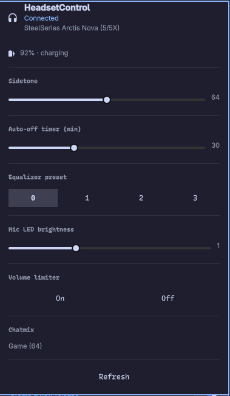

# omarchy-headsetcontrol

A headset widget for the Omarchy bar. One icon shows whether a supported
headset is connected and how much battery it has left; one panel drives
everything HeadsetControl exposes — sidetone, lights, equalizer presets,
auto-off timer, mic LED brightness, chatmix, Bluetooth options and more.

It is a front-end for [HeadsetControl](https://github.com/Sapd/HeadsetControl),
which the widget shells out to in JSON mode. Sections appear only when the
connected headset actually reports the capability: no sidetone support, no
sidetone slider; no battery chip, no percentage.

## Install

```bash
omarchy plugin add https://github.com/hrzlgnm/omarchy-headsetcontrol.git
omarchy plugin enable hrzlgnm.headsetcontrol
```

Plugins land disabled so you can read the code before it runs — it runs
unsandboxed inside `omarchy-shell`, like every Omarchy plugin. **Setup ›
Plugins** does the same thing from the menu.

The icon appears at the right end of the bar. Move it with
`omarchy bar move hrzlgnm.headsetcontrol --before omarchy.clock`, or any
other placement.

To update later: `omarchy plugin update`. To remove:
`omarchy plugin remove hrzlgnm.headsetcontrol`.

## Requirements

- Omarchy with its Quickshell desktop.
- The `headsetcontrol` CLI — from your distro's packages or the
  [HeadsetControl releases](https://github.com/Sapd/HeadsetControl/releases).
- A supported headset, connected over USB or Bluetooth.

## Using it



The bar icon is dim when no headset is detected and bright when one is.
With a battery, it shows the percentage next to the headset glyph.

| Action | Result |
|--------|--------|
| Left click | Open the panel |
| Right click | Refresh device state |

Inside the panel:

- **Header** — headset name and connection state, plus a battery row with
  level and status (charging / discharging / full).
- **Sidetone** — slider from 0 to 128. Right-click it to mute (0).
- **Lights** — turn the headset LEDs on or off.
- **Auto-off timer** — minutes of inactivity before the headset powers itself
  down (0 is off).
- **Equalizer preset** — one of four presets (0–3).
- **Voice prompts** — enable or disable spoken prompts.
- **Mic LED brightness** — 0 to 3.
- **Volume limiter** — on or off.
- **Chatmix** — the current game/chat balance (read-only).
- **Notification sound** — 0 or 1.
- **Bluetooth** — power-on behaviour and call volume.
- **Refresh** — re-query the device.

Device state is polled in the background every `pollingInterval` seconds and
whenever the panel opens. Right-click the bar icon to force a refresh.

## Settings

Configure these in **Setup › Plugins**, or in the widget's entry in
`~/.config/omarchy/shell.json`.

| Setting | Default | What it does |
|---------|---------|--------------|
| `pollingInterval` | `30` | Seconds between background polls. `0` disables polling; the panel still refreshes when opened |
| `barShowPercentage` | `true` | Show the battery percentage next to the bar icon |
| `lastSidetone` | `64` | Level the sidetone slider starts at |
| `lastEqPreset` | `0` | Preset the equalizer starts selected at |

Sidetone and EQ changes write their level back into the widget's settings, so
they survive a restart.

## Scripting

The widget answers on the shell's IPC bus under the target
`hrzlgnm.headsetcontrol`:

```bash
omarchy-shell hrzlgnm.headsetcontrol toggle
omarchy-shell hrzlgnm.headsetcontrol refresh
omarchy-shell hrzlgnm.headsetcontrol checkConnected
omarchy-shell hrzlgnm.headsetcontrol setSidetone 80
omarchy-shell hrzlgnm.headsetcontrol setLights true
omarchy-shell hrzlgnm.headsetcontrol setInactiveTime 15
omarchy-shell hrzlgnm.headsetcontrol setVoicePrompt false
omarchy-shell hrzlgnm.headsetcontrol setEqualizerPreset 2
omarchy-shell hrzlgnm.headsetcontrol setEqualizer "150 200 300 300 400 500 600 800 1000 1200 1400 1600 2000 2400 3000 4000 5000 6000 8000 12000 14000 16000 20000"
omarchy-shell hrzlgnm.headsetcontrol setMicMuteLedBrightness 2
omarchy-shell hrzlgnm.headsetcontrol setVolumeLimiter true
omarchy-shell hrzlgnm.headsetcontrol setBtPowerOn true
omarchy-shell hrzlgnm.headsetcontrol setBtCallVolume 60
omarchy-shell hrzlgnm.headsetcontrol sendNotification 1
```

## License

MIT. See [LICENSE](LICENSE).
